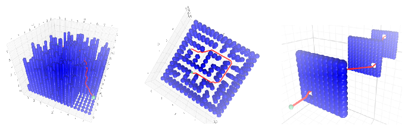

## Project
We generated scripts to generate three random environments. One environment is designed to represent a city-like environment, one is made to represent a maze, and one environment consists of walls with small holes to go through as shown above.



Next, we implemented the RRT* and Bidirectional RRT* algorithms from scratch and implemented them in gym-pybullet. A drone was then made to traverse each of the environments.


## Installation
First install gym-pybullet-drones and create the drones environment
```shell
git clone https://github.com/utiasDSL/gym-pybullet-drones.git
cd gym-pybullet-drones/

conda create -n drones python=3.10
conda activate drones

pip3 install --upgrade pip
pip3 install -e .
```

Once gym-pybullet-drones has been installed, install the regular and Bidirectional RRT* algorithms that we wrote ourselves as follows
```shell
cd gym_pybullet_drones/examples/

git clone https://github.com/RicardoRamautar/final_pdm.git
```

## Running the code
The `examples` folder should now contain two subfolders: `RRT_star` and `Bidirectional_RRT`.

The `RRT_star/RRT_star.py` script executes the RRT* path planning algorithm and runs the simulation. Similarly, `Bidirectional_RRT/Bidirectional_RRT.py` runs the bidirectional RRT* algorithm and runs the simulations. Running either file

Both folders `RRT_star` and `Bidirectional_RRT` contain a file called `variables.py`. This file contains some parameters for the RRT algorithms that can be adjusted. However, these values should already be good enough to run the algorithms successfully on the environments that have been set up. 

## Environments
Both folders contain three different environments. One is a maze. One is a very dense, city-like environment, and the other one consists of three consecutive walls, each with a hole through which the drone needs to fly. 

Switch between environments as follows:
- **Standard Maze** - To load the maze environment that was used to evaluate the performance in the paper, set the following parameters in `variables.py`:
```python
ENVIRONMENT = load_maze
ENVIRONMENT_SPHERES = load_maze_env
```
- **Standard Walls** - To load the walls environment that was used to evaluate the performance in the paper, set the following parameters in `variables.py`:
```python
ENVIRONMENT = load_walls
ENVIRONMENT_SPHERES = load_walls_env
```
- **Standard City** - To load the city environment that was used to evaluate the performance in the paper, set the following parameters in `variables.py`:
```python
ENVIRONMENT = load_city
ENVIRONMENT_SPHERES = load_city_env
```

However, we have also written scripts that generate random maze, city, and wall environments. A random wall, maze, or city environment can be generated by running the `generateWalls.py`, `generateMaze.py`, `generateCity.py`, respectively. Note that both `RRT_star` and `Bidirectional_RRT` contain these scripts, so run the correct one. Once you have created a random environment, you can load them as follows. In `variables.py` set the following parameters:
```python
ENVIRONMENT = load_random_{environment}
ENVIRONMENT_SPHERES = load_random_{environment}_env
```
For `environment` in `[maze, walls, city]`

## Comments
If the path planning algorithms do not manage to find a path, increase the number of iterations that are executed. In both files, the number of iterations is set in the function call to `RRT()`.